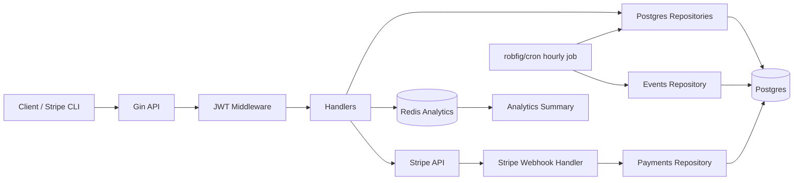

# 

A Go API for managing users, appointments, payments, usage analytics, and Stripe-backed payment workflows.

## Architecture



## Prerequisites

- Go 1.25+
- Docker and Docker Compose
- Stripe account with test mode enabled
- Stripe CLI for webhook testing

## Setup

1. Copy the environment file and fill in local values:

   ```bash
   cp .env.example .env
   ```

2. Start Postgres and Redis:

   ```bash
   docker-compose up -d
   ```

3. Run the database migrations in order:

   ```bash
   psql "$POSTGRES_DSN" -f migrations/0001_init.up.sql
   psql "$POSTGRES_DSN" -f migrations/0002_stripe_payments_webhooks.up.sql
   ```

   If you prefer a manual DSN, use the values from `.env` and connect to the `employee_management` database.

4. Run the API:

   ```bash
   go run .
   ```

5. Run the test suite:

   ```bash
   go test ./...
   ```

## Webhook Testing

Use the Stripe CLI to forward test-mode webhook events to the local API:

```bash
stripe login
stripe listen --forward-to localhost:8080/api/webhooks/stripe
```

The CLI prints a webhook signing secret. Set that value as `STRIPE_WEBHOOK_SECRET` in `.env`.

Then trigger a test payment flow or send a test event, for example:

```bash
stripe trigger payment_intent.succeeded
```

## API Overview

- `POST /auth/signup`
- `POST /auth/login`
- `GET /health`
- `POST /api/appointments`
- `GET /api/appointments`
- `GET /api/appointments/:id`
- `PATCH /api/appointments/:id`
- `DELETE /api/appointments/:id`
- `POST /api/payments/intent`
- `POST /api/webhooks/stripe`
- `POST /api/events`
- `GET /api/analytics/summary`

The `/api/*` routes require a valid JWT, and `/api/analytics/summary` is admin-only.
